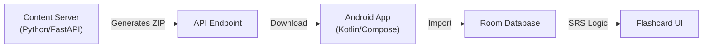

# DeutschStart 🇩🇪

**A1 German Learning App with Audio-First Content Generation.**

This project consists of an **Android App** (Offline, SRS, Audio) and a **Content Server** (Python, FastAPI, Piper TTS). The goal is to provide a free, high-quality, audio-focused learning experience for A1 German learners.

## 🏗️ Architecture

### 1. Content Server (`server/`)
Generates high-quality content packs using a hybrid pipeline:
-   **Data Sources**: ChatGPT Pro (Manual/Creative) + Kaikki.org (Morphology/Validation).
-   **Pipeline**: Import -> Validate (A1 Rules) -> TTS (Piper) -> Package.
-   **Output**: ZIP files containing `vocabulary.json` and optimized OGG audio.

**Key Features**:
-   **Piper TTS**: High-quality neural TTS (Thorsten voice).
-   **Validation**: Ensures words are actually A1 and morphologically correct.
-   **Packaging**: Creates checksummed ZIPs for atomic updates.

### 2. Android Client (`client/android/`)
A modern, offline-first Android application.
-   **Tech Stack**: Kotlin, Jetpack Compose, Hilt, Room, Retrofit, Coil.
-   **Features**:
    -   **Content Manager**: Downloads and installs packs from the server.
    -   **Flashcard System**: Audio-rich flashcards with Example Sentences.
    -   **Spaced Repetition (SRS)**: Smart scheduling based on user ratings (Leitner system).
    -   **Smart Dashboard**: Tracks learned words and due reviews.

## 🚀 Getting Started

### Prerequisites
-   **Docker** (for Server)
-   **Android Studio** (for Client)

### Running the Server
1.  Navigate to `server/`.
2.  Run `docker-compose up --build`.
3.  API available at `http://localhost:8000`.
4.  Place `piper` binary in `server/piper/` if running locally without Docker (or use the Dockerfile which handles it).

### Running the Client
1.  Open `client/android` in Android Studio.
2.  Sync Gradle.
3.  Run on Emulator (default connects to `10.0.2.2:8000`).
    -   *Note*: Ensure Server is running first.

## 📦 Content Workflow
1.  **Generate**: Server script `generate_pack` creates a ZIP.
2.  **Serve**: Available at `http://localhost:8000/api/v1/packs/latest`.
3.  **Download**: Open App -> Manage Content -> Check for Updates.

## 📜 License
MIT
